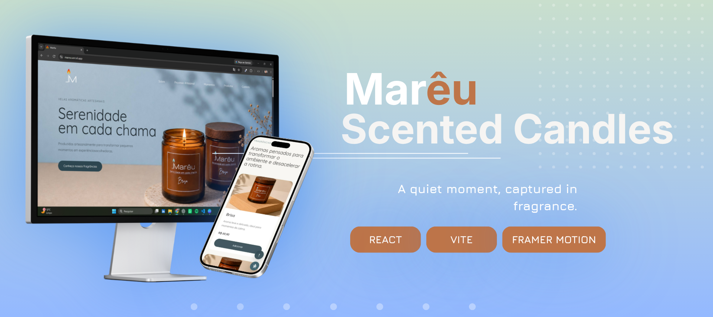

  

<h1 align="center">Marêu</h1>

  A sensory landing page created for a candle brand focused on meaningful moments.

  <a href="https://mareu.vercel.app/">🌐 Live Demo</a>
  ·
  <a href="#-português">🇧🇷 Português</a>
  ·
  <a href="#-english">🇺🇸 English</a>

---

## 📊 Project Overview

|                |                  |
| :------------- | :--------------- |
| **Status**     | ✅ Completed     |
| **Type**       | Personal Project |
| **Framework**  | React            |
| **Build Tool** | Vite             |
| **Language**   | JavaScript       |
| **Styling**    | CSS3             |
| **Animation**  | Framer Motion    |
| **Icons**      | Lucide React     |
| **Deployment** | Vercel           |

---

# 🇧🇷 Português

## 📖 Sobre o projeto

**Marêu** é uma landing page criada para uma marca de velas aromáticas.

O projeto foi desenvolvido com foco em **identidade visual, experiência do usuário e apresentação de produtos**, buscando transformar a navegação em uma experiência mais sensorial e envolvente.

A interface combina uma estética minimalista com animações e elementos visuais para apresentar a marca, seus produtos e os momentos associados à experiência Marêu.

---

## ✨ Funcionalidades

- Interface responsiva
- Apresentação da identidade da marca
- Seção de produtos
- Seção sobre o processo de produção
- Seção de momentos e experiências
- Formulário de contato
- Animações e transições visuais
- Carrinho flutuante
- Botão para voltar ao topo
- Navegação por seções

---

## 🛠️ Tecnologias

- React
- Vite
- JavaScript
- CSS3
- Framer Motion
- Lucide React

---

## 🎨 Foco do projeto

O principal objetivo do projeto foi unir **design e desenvolvimento Front-end** para criar uma experiência digital coerente com a proposta da marca.

Durante o desenvolvimento, trabalhei principalmente com:

- Identidade visual
- Design de interfaces
- Experiência do usuário
- Apresentação de produtos
- Animações e microinterações

---

## 📷 Preview

  

---

## 🌐 Acesse o projeto

🔗 https://mareu.vercel.app/

---

## 💡 Aprendizados

Durante o desenvolvimento deste projeto, pratiquei e aprimorei conhecimentos em:

- Desenvolvimento de interfaces com React
- Organização e reutilização de componentes
- Criação de landing pages
- Responsividade
- Animações com Framer Motion
- Criação de experiências visuais
- Uso de bibliotecas de ícones
- Organização de projetos Front-end

---

## 🔮 Melhorias futuras

- Melhorar a acessibilidade da aplicação
- Aprimorar a experiência em dispositivos móveis
- Otimizar o carregamento de imagens e mídias
- Expandir a experiência de compra
- Adicionar novas interações à interface

---

# 🇺🇸 English

## 📖 About the project

**Marêu** is a landing page created for an aromatic candle brand.

The project was developed with a focus on **visual identity, user experience and product presentation**, aiming to turn navigation into a more sensory and engaging experience.

The interface combines a minimalist aesthetic with animations and visual elements to present the brand, its products and the moments associated with the Marêu experience.

---

## ✨ Features

- Responsive interface
- Brand identity presentation
- Product showcase
- Production process section
- Moments and experiences section
- Contact form
- Visual animations and transitions
- Floating cart
- Scroll-to-top button
- Section-based navigation

---

## 🛠️ Technologies

- React
- Vite
- JavaScript
- CSS3
- Framer Motion
- Lucide React

---

## 🎨 Project focus

The main goal of this project was to combine **design and Front-end development** to create a digital experience aligned with the brand's concept.

Throughout the development process, I focused mainly on:

- Visual identity
- Interface design
- User experience
- Product presentation
- Animations and microinteractions

---

## 🌐 Live Demo

🔗 https://mareu.vercel.app/

---

## 💡 What I learned

Throughout this project, I practiced and improved my knowledge of:

- React interface development
- Component organization and reusability
- Landing page development
- Responsive design
- Animations with Framer Motion
- Creating visual experiences
- Using icon libraries
- Front-end project organization

---

## 🔮 Future improvements

- Improve application accessibility
- Enhance the mobile experience
- Optimize image and media loading
- Expand the shopping experience
- Add new interface interactions

---

  <i>Designing experiences through code.</i>

